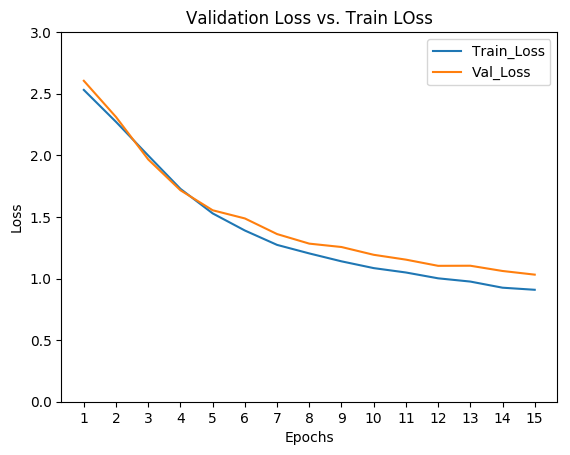
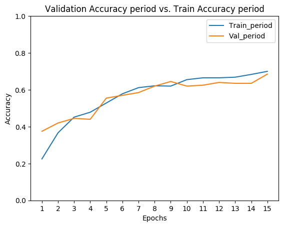
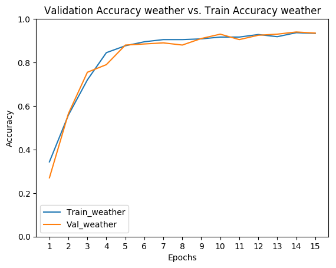
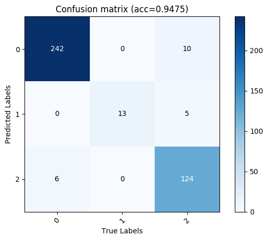
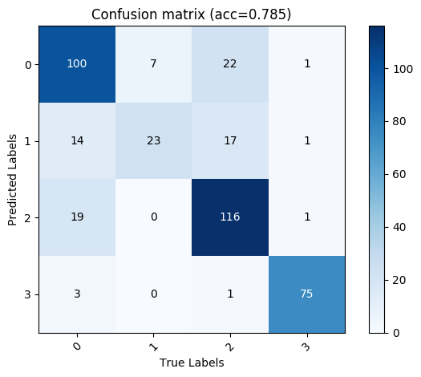

# Context_Detect

## Contents  
- [Environment](#Environment)  
- [Structure](#Structure)  
- [Dataset](#Dataset)   
- [Training](#Training)
- [Results](#Results) 


## Environment
* Linux version 4.15.0-175-generic
* Python 3.7.2  
* Pytorch1.0.0.dev20190219

## Structure

  ├── [main.py](./main.py): Training pipeline   
  ├── data: ONCE dataset  
  ├── [src](./src): Functions   
  ├────[count_value.py](./src/count_value.py): Count sample classes distribution according to path list    
  ├────[find_files.py](./src/find_files.py): Find all json files under path     
  ├────[model_parameter.py](./src/model_parameter.py): Set up model   
  ├────[Once_dataset.py](./src/Once_dataset.py): Set up Once dataset for train val and test   
  └────[statics.py](./src/statics.py): Retrun json dict with json title and label correlation   

## Dataset
* ONCE data downloaded from [ONCE download](https://once-for-auto-driving.github.io/download.html)

## Training
* Make sure to prepare the dataset in advance
* Modify the relative paths of datasets in the code.
* run main.py


## Results



* Weather

* Period



* Results in cmd
```
period class distribution {'morning': 415, 'noon': 101, 'afternoon': 476, 'night': 208}
weather class distribution {'sunny': 734, 'cloudy': 61, 'rainy': 405}
----------
Epoch 0
train_Loss: 2.5365905729929605 Period_Acc: 0.2633333333333333 Weather_Acc: 0.3958333333333333
val_Loss: 2.1934428596496582 Period_Acc: 0.3475 Weather_Acc: 0.7375
----------
Epoch 1
train_Loss: 1.9440492963790894 Period_Acc: 0.41583333333333333 Weather_Acc: 0.7808333333333334
val_Loss: 1.6080401372909545 Period_Acc: 0.51 Weather_Acc: 0.8425
----------
Epoch 2
train_Loss: 1.4537310330073039 Period_Acc: 0.575 Weather_Acc: 0.8941666666666667
val_Loss: 1.3279751682281493 Period_Acc: 0.6125 Weather_Acc: 0.875
----------
Epoch 3
train_Loss: 1.2569761387507121 Period_Acc: 0.5916666666666667 Weather_Acc: 0.91
val_Loss: 1.1458076858520507 Period_Acc: 0.655 Weather_Acc: 0.8925
----------
Epoch 4
train_Loss: 1.1066125106811524 Period_Acc: 0.6675 Weather_Acc: 0.9225
val_Loss: 1.0779276943206788 Period_Acc: 0.705 Weather_Acc: 0.885
----------
Epoch 5
train_Loss: 1.0111921803156534 Period_Acc: 0.68 Weather_Acc: 0.9291666666666667
val_Loss: 0.9810182189941407 Period_Acc: 0.73 Weather_Acc: 0.915
----------
Epoch 6
train_Loss: 0.9422087184588115 Period_Acc: 0.6975 Weather_Acc: 0.9391666666666667
val_Loss: 0.9573048543930054 Period_Acc: 0.7075 Weather_Acc: 0.9125
----------
Epoch 7
train_Loss: 0.8959438467025757 Period_Acc: 0.7083333333333334 Weather_Acc: 0.9416666666666667
val_Loss: 0.9152120685577393 Period_Acc: 0.7125 Weather_Acc: 0.9175
----------
Epoch 8
train_Loss: 0.8469912425676982 Period_Acc: 0.7291666666666666 Weather_Acc: 0.9466666666666667
val_Loss: 0.8805615711212158 Period_Acc: 0.7275 Weather_Acc: 0.9125
----------
Epoch 9
train_Loss: 0.8098081374168395 Period_Acc: 0.7375 Weather_Acc: 0.9466666666666667
val_Loss: 0.8409724473953247 Period_Acc: 0.7525 Weather_Acc: 0.92
----------
Epoch 10
train_Loss: 0.783109032313029 Period_Acc: 0.7475 Weather_Acc: 0.9516666666666667
val_Loss: 0.8093857097625733 Period_Acc: 0.75 Weather_Acc: 0.93
----------
Epoch 11
train_Loss: 0.7574784207344055 Period_Acc: 0.76 Weather_Acc: 0.955
val_Loss: 0.7875262117385864 Period_Acc: 0.755 Weather_Acc: 0.925
----------
Epoch 12
train_Loss: 0.7281497557957967 Period_Acc: 0.7641666666666667 Weather_Acc: 0.9558333333333333
val_Loss: 0.7806064033508301 Period_Acc: 0.7525 Weather_Acc: 0.935
----------
Epoch 13
train_Loss: 0.7160448082288107 Period_Acc: 0.77 Weather_Acc: 0.9525
val_Loss: 0.7538835573196411 Period_Acc: 0.76 Weather_Acc: 0.94
----------
Epoch 14
train_Loss: 0.6827237804730734 Period_Acc: 0.785 Weather_Acc: 0.9658333333333333
val_Loss: 0.7378260564804077 Period_Acc: 0.7675 Weather_Acc: 0.93
Training Epoch compete in 30.0m 33.10092043876648s
----------
Accuracy of morning : 73 %
Accuracy of  noon : 76 %
Accuracy of afternoon : 74 %
Accuracy of night : 96 %
----------
Accuracy of sunny : 97 %
Accuracy of cloudy : 100 %
Accuracy of rainy : 89 %
test_Loss: 0.7516205525398254 Period_Acc: 0.785 Weather_Acc: 0.9475
----------
period creterion
+---+-----------+--------+-------------+-------+
|   | Precision | Recall | Specificity |   F1  |
+---+-----------+--------+-------------+-------+
| 0 |   0.769   | 0.735  |    0.886    | 0.752 |
| 1 |   0.418   | 0.767  |    0.914    | 0.541 |
| 2 |   0.853   | 0.744  |    0.918    | 0.795 |
| 3 |   0.949   | 0.962  |    0.988    | 0.955 |
+---+-----------+--------+-------------+-------+
weather creterion
+---+-----------+--------+-------------+-------+
|   | Precision | Recall | Specificity |   F1  |
+---+-----------+--------+-------------+-------+
| 0 |    0.96   | 0.976  |    0.934    | 0.968 |
| 1 |   0.722   |  1.0   |    0.987    | 0.839 |
| 2 |   0.954   | 0.892  |    0.977    | 0.922 |
+---+-----------+--------+-------------+-------+
```
